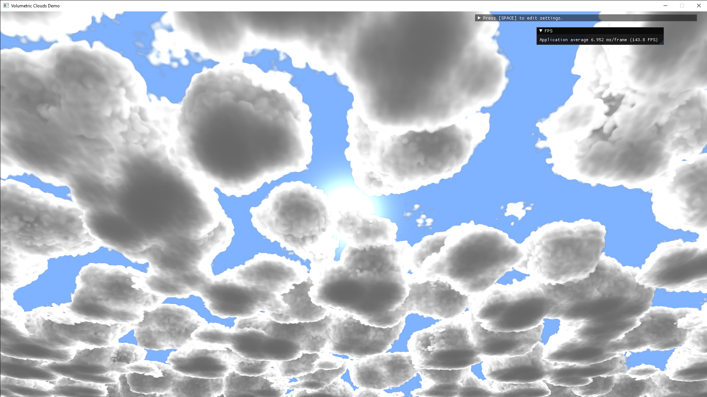

# Volumetric Cloud Demo

Raymarching implementation for rendering volumetric clouds in OpenGL.

## References

"GPU Pro 7: Advanced Rendering Techniques" by Wolfgang Engel
"The Real-time Volumetric Cloudscapes of Horizon: Zero Dawn" by Andrew Schneider

## Other Libraries Used

ImGui
GLAD
GLFW
stb
